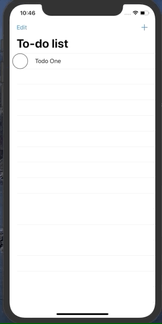
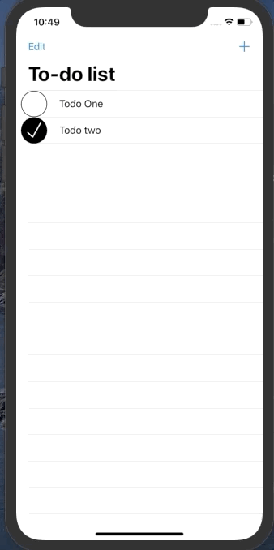
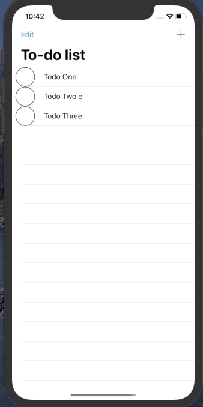

# To-Do List

    This application was created only for educational purposes.
## Requirements: 
* Xcode 10 + 
* Swift 4.0 +

## About:
To-Do list task manager with simple UI and functionality.

## Screenshots:
##### add to-do item.

##### mark as complete.

##### remove unnecessary items.

